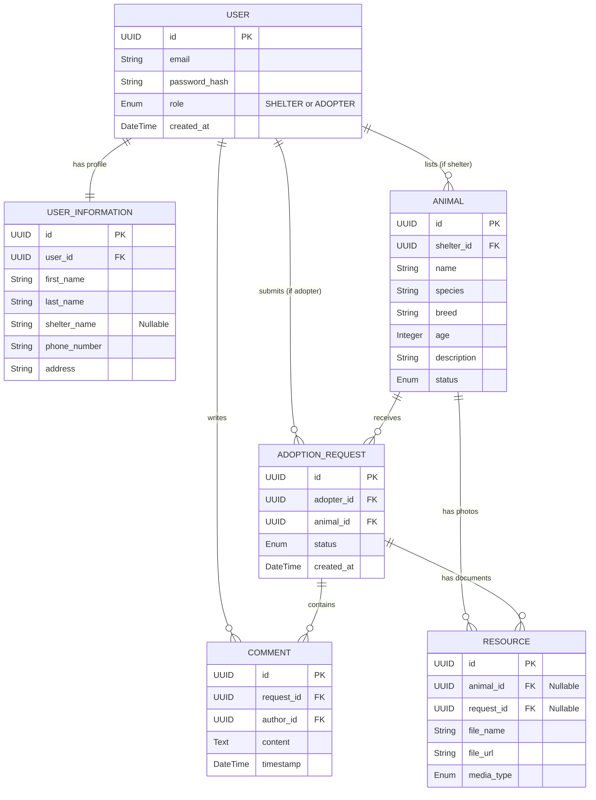

# Entity-Relationship Diagram

This document contains the ER diagram for the Pet Adoption Shelter application.

### Entities

*   **USER**: Represents a registered user of the platform. Can be a potential adopter or a shelter representative.
    *   `role`: Determines the user's permissions (either `SHELTER` or `ADOPTER`).

*   **USER_INFORMATION**: Contains the detailed personal or organizational information for a `USER`.
    *   `shelter_name`: Only applicable if the user's role is `SHELTER`.

*   **ANIMAL**: Represents an animal listed for adoption by a shelter.
    *   `shelter_id`: Foreign key linking the animal to the `USER` (shelter) that listed it.
    *   `status`: The current adoption status of the animal (e.g., "Available", "Pending", "Adopted").

*   **ADOPTION_REQUEST**: A formal request submitted by an `ADOPTER` to adopt an `ANIMAL`.
    *   `adopter_id`: The user who is applying for adoption.
    *   `animal_id`: The animal that is the subject of the request.
    *   `status`: The current status of the adoption request (e.g., "Pending", "Approved", "Rejected").

*   **COMMENT**: A message or note attached to an `ADOPTION_REQUEST`, allowing communication between the adopter and the shelter.
    *   `request_id`: Links the comment to a specific adoption request.
    *   `author_id`: The user who wrote the comment.

*   **RESOURCE**: Represents a media file (like a photo or document) associated with an animal or an adoption request.
    *   `animal_id`: Links a resource (e.g., a photo) to an animal's profile.
    *   `request_id`: Links a resource (e.g., a scanned document) to an adoption request.
    *   `media_type`: Specifies the type of the file (e.g., "Image", "PDF").